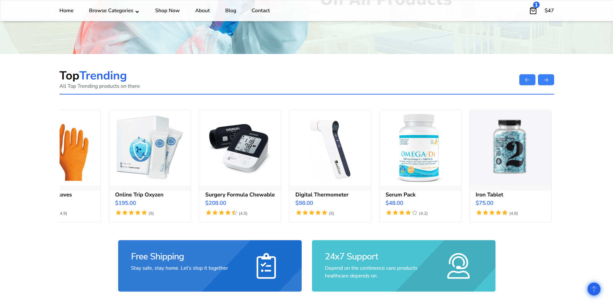
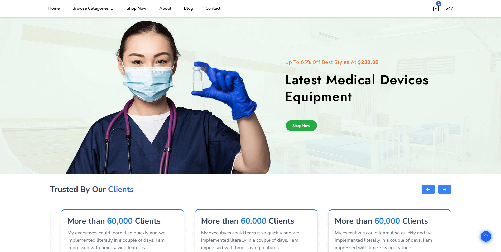

# Health-OS Front-End

## 🕰️ Project History

- 🔹 Originally developed in: **2022**
- 🔹 Last updated/refactored in: **2025** (backend improvements and minor changes)

A modern, responsive e-commerce web application built with React, Redux Toolkit, and Tailwind CSS. This project is designed for seamless shopping experiences, featuring dynamic product categories, banners, and a clean, user-friendly interface. Perfect for showcasing in your portfolio or as a foundation for a production-ready online store.

## Features

- 🛒 **E-commerce Functionality**: Browse products by category, view best sellers, new arrivals, and deals of the day.
- 🎨 **Modern UI/UX**: Built with Tailwind CSS for a beautiful, responsive design across all devices.
- ⚡ **Performance**: Optimized for fast load times and smooth navigation.
- 🔄 **Dynamic Content**: Product categories, banners, and offers are fetched and rendered dynamically.
- 🔐 **Authentication**: Secure login and signup flows (with Redux Toolkit slices for auth management).
- 📰 **Blog & News**: Integrated blog/news section for content marketing.
- 🛠️ **Reusable Components**: Modular structure for easy maintenance and scalability.

## Tech Stack

- **React** (with functional components & hooks)
- **Redux Toolkit** (state management)
- **Tailwind CSS** (utility-first styling)
- **Swiper.js** (responsive sliders)
- **React Router** (routing)

## Getting Started

### Prerequisites
- Node.js (v16 or above recommended)
- npm or yarn

### Installation

```bash
# Clone the repository
git clone https://github.com/your-username/Health-OS-Front-End.git
cd Health-OS-Front-End

# Install dependencies
npm install
# or
yarn install
```

### Running the App

```bash
npm start
# or
yarn start
```

The app will be available at `http://localhost:3000`.

## Folder Structure

```
Health-OS-Front-End/
├── public/
├── src/
│   ├── app/            # Redux store setup
│   ├── Assets/         # Images & icons
│   ├── Components/     # UI components & pages
│   ├── features/       # Redux slices
│   ├── utils/          # Utility functions & data
│   └── ...
├── package.json
└── README.md
```

## Screenshots

Below are screenshots of the application UI and features:

<p align="center">
  
  
  
  
  
  
  
  
  
  
  
</p>

## License

This project is open source and available under the [MIT License](LICENSE).

## Author

- [Name](Md. Ashraful Islam)
- [Email](contact.ashraful1@gmail.com)

---

> This project is part of my portfolio. And Make it in 2022 Feel free to check out my other work!

### `Client Health OS`

### `Server Link` https://github.com/Ashraful2880/Health-OS-Server

### `Live URL` https://health-os.netlify.app/home
